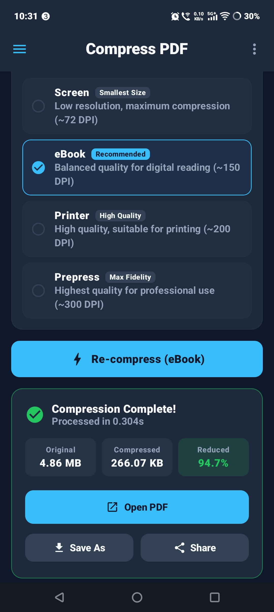

# Pocket PDF - 100% Offline Native Android App (Kotlin & Jetpack Compose)

<p align="center">
  
  
  
  
  
  
  
</p>

> ### 🔒 100% Offline • 0% Internet Needed
> **Pocket PDF is built strictly for offline privacy.** It requires **0% internet connection** to operate. In fact, the app **does not even declare or request internet permission** (`android.permission.INTERNET`) in its manifest. Your sensitive documents, receipts, and photos never leave your device and are never uploaded to any remote server or cloud service.

<p align="center">
  
</p>

A high-performance, **100% offline** native Android utility built with **Kotlin** and **Jetpack Compose**. It provides two core on-device tools without requiring a single byte of internet data:
1. **Compress PDF**: Shrinks PDF file sizes completely on-device using hardware-accelerated rendering and multi-tier quality presets.
2. **Images to PDF**: Combines multiple photos/images into a single PDF document with automatic EXIF orientation correction, thumbnail reordering, and A4 page layout.

---

## 🛡️ Why 100% Offline Matters (0% Internet Guarantee)

- 🚫 **Zero Internet Permissions:** The app's `AndroidManifest.xml` does not include `android.permission.INTERNET`. It is physically incapable of transmitting your files, telemetry, or personal data over the web.
- ✈️ **Works Anytime, Anywhere:** Fully functional in Airplane Mode, in remote areas with zero cell reception, or when mobile data and Wi-Fi are completely disabled.
- 🔐 **Absolute Document Privacy:** Compress confidential contracts, bank statements, personal photos, or IDs with complete peace of mind—nothing ever leaves your device.
- ⚡ **Instant Processing & Zero Data Usage:** No upload/download wait times, server queues, bandwidth consumption, or risk of data leaks.

---

## ✨ Features

### 🗜️ 1. PDF Compressor (100% On-Device)
- 📱 **100% On-Device & Offline:** Zero network calls; files never leave your device.
- ⚙️ **4 Compression Presets:**
  - **Screen (`screen`):** Low resolution, aggressive compression (~72 DPI) for maximum space savings.
  - **eBook (`ebook`):** Balanced quality (~150 DPI) optimized for digital reading.
  - **Printer (`printer`):** High quality (~200 DPI) suitable for office printing.
  - **Prepress (`prepress`):** Highest fidelity (~300 DPI) preserving fine document details.
- 📊 **Real-Time Progress & Stats:**
  - Live page-by-page progress bar.
  - Instant compression comparison (Original Size vs. Compressed Size vs. Space Saved %).

### 🖼️ 2. Images to PDF Converter (Fully Offline)
- 📸 **Multi-Image Selection:** Pick multiple images (JPG, PNG, WEBP) from your local gallery or file manager.
- 🔄 **Thumbnail Reordering:** Visual preview of all selected images with quick Move Left / Move Right and individual image deletion controls.
- 🧭 **Auto EXIF Rotation:** Corrects camera photo orientations so portrait photos are never rendered sideways.
- 📄 **Flexible Page Layout:**
  - **Standard A4 (595 × 842 pt):** Cleanly fits and centers images onto standard document pages with margins (great for assignments and printing).
  - **Fit Image Bounds:** Dynamically sizes each page to match the image's exact aspect ratio.
- 🎚️ **Quality Control:** Choose between Compact (55% JPEG), Balanced (75% JPEG), and High Quality (90% JPEG) to keep the generated PDF size under control.

### 💾 3. Storage & Sharing
- **Storage Access Framework (SAF):** "Save As" file picker to name and save PDFs locally to any folder (Downloads, Documents, SD card).
- **Android Share Sheet:** Send compressed or generated PDFs directly via WhatsApp, Gmail, Telegram, Google Drive, etc.

---

## 🛠️ Tech Stack

| Layer | Technology |
|---|---|
| **Internet / Network** | **0% Needed (No `INTERNET` permission in Manifest)** |
| **Privacy Mode** | **100% Offline & On-Device Processing** |
| **Language** | Kotlin 2.1.0 |
| **UI Framework** | Jetpack Compose (BOM 2024.11.00) + Material 3 |
| **Image Loading** | Coil Compose 2.7.0 |
| **EXIF Handling** | AndroidX ExifInterface 1.3.7 |
| **Architecture** | MVVM (Model-View-ViewModel) + StateFlow |
| **Concurrency** | Kotlin Coroutines (`Dispatchers.IO`) |
| **PDF Engine** | Native `android.graphics.pdf.PdfRenderer` + `PdfDocument` |
| **Min / Target SDK** | Android 7.0 (API 24) / Android 15 (API 35) |

---

## ⚡ Getting Started

### Prerequisites

- **Android Studio Ladybug (2024.2+)** or newer.
- **JDK 17** or newer configured in Android Studio.
- Android device or emulator running Android 7.0+ (API 24+).

### Opening & Running the Project

1. Open **Android Studio**.
2. Select **Open** and choose this directory (`PDF_Compressor_APK-main`).
3. Allow Gradle to sync dependencies.
4. Click **Run** (`Shift + F10`) or select your target device.

### Building APK via Terminal

```bash
# Build Debug APK
./gradlew assembleDebug

# The APK will be generated at:
# app/build/outputs/apk/debug/app-debug.apk
```

---

## 👨‍💻 Author

Made with 💙 by **M-Salman-khan**

---

## 📜 License

This project is distributed under the MIT License. See LICENSE for more information.
